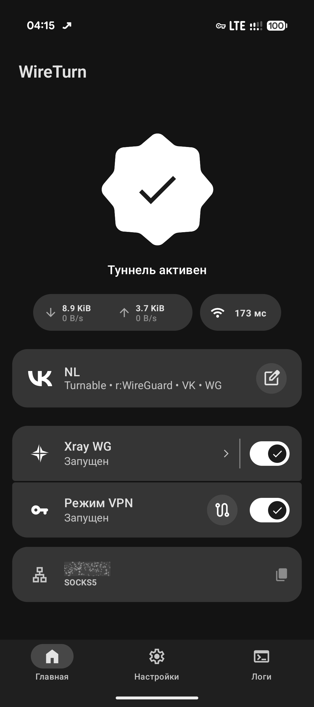
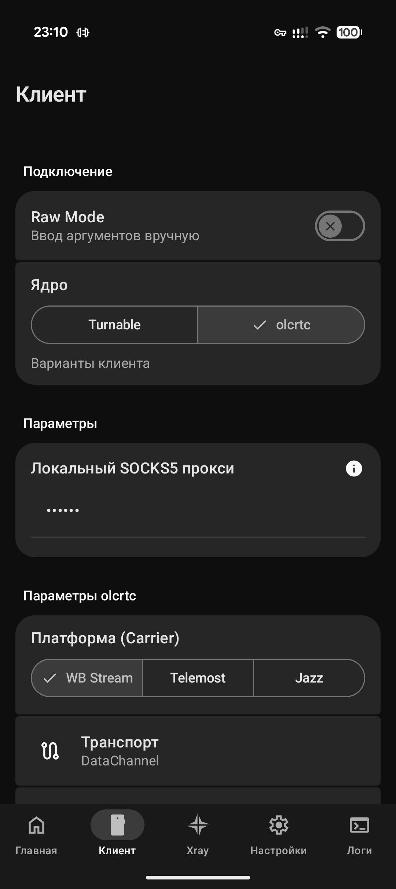
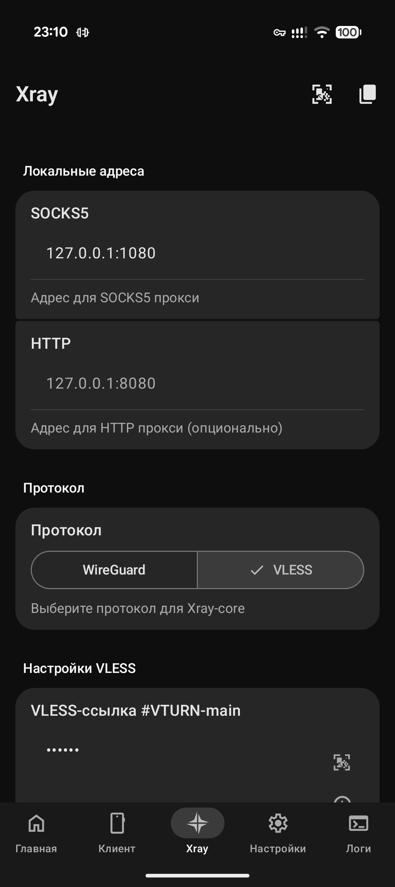
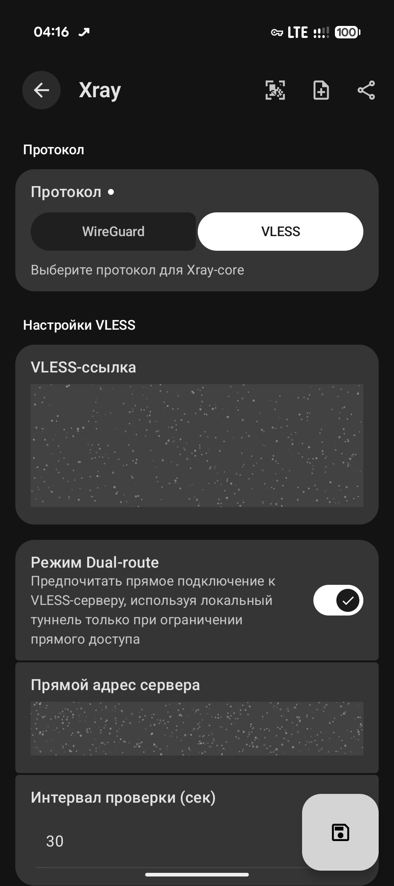
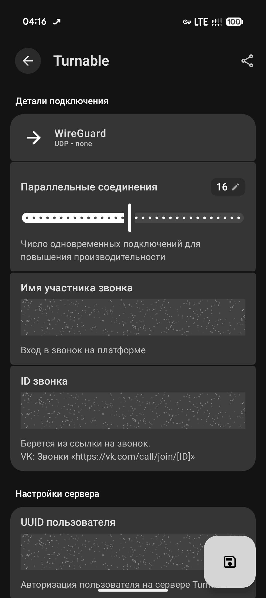
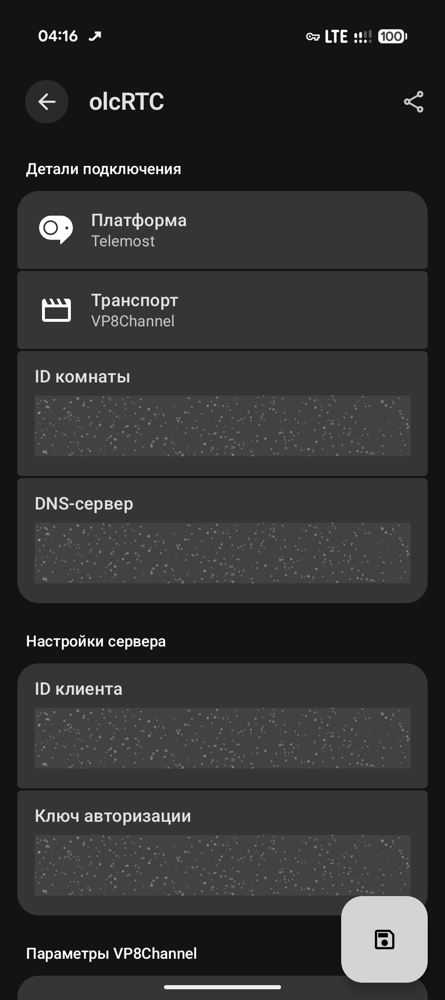

<p align="center">
  
</p>

# WireTurn — Android WebRTC & WebDAV Tunnel

Android-клиент для [Turnable](https://github.com/TheAirBlow/Turnable), [olcRTC](https://github.com/openlibrecommunity/olcrtc) и [WebDAV](https://github.com/spkprsnts/webdav-tunnel) — туннелирование трафика через WebRTC и WebDAV.

> **Disclaimer:** Проект предназначен исключительно для образовательных и исследовательских целей.

## Принцип работы

WireTurn интегрирует возможности **Turnable**, **olcRTC** и **WebDAV** в Android, позволяя упаковывать трафик в стандартные протоколы WebRTC (**DTLS** или **SRTP**) или передавать его через облачные хранилища.

### Turnable
Обеспечивает туннелирование TCP/UDP трафика через TURN-серверы или SFU-платформы.
- **Multi-Peer:** Распределяет трафик по нескольким параллельным WebRTC-соединениям (пирам) для повышения пропускной способности и стабильности.
- **Мультиплексирование:** Позволяет эффективно передавать множество независимых потоков данных внутри установленных сессий.
- **Имитация медиа-трафика:** Опционально использует **SRTP** (Secure RTP) с DTLS-рукопожатием, маскируя пакеты под зашифрованный видеопоток (VP8). Это необходимо для работы через SFU-платформы в режиме Relay.
- **Шифрование:** Обязательное сквозное шифрование для рукопожатия и настраиваемое шифрование для передаваемых данных.

### olcRTC
Туннелирование через платформы видеоконференций с использованием различных WebRTC-транспортов. Реализует SOCKS5-прокси для подключения:
- **DataChannel**: Передача через стандартные каналы данных WebRTC (SCTP). Обеспечивает высокую скорость и низкие задержки.
- **VP8Channel**: Стеганография внутри видеопотока VP8. Пакеты маскируются под валидные ключевые кадры видео и передаются с использованием надежного протокола KCP поверх них.
- **SEIChannel**: Упаковка данных в метаданные видеопотока H.264. Использует Supplemental Enhancement Information (SEI) сообщения для скрытой передачи пакетов.
- **VideoChannel**: Визуальная стеганография. Данные кодируются в QR-коды или специальные графические тайлы и транслируются как реальный видеопоток.

### WebDAV
Туннелирование трафика через любое WebDAV-совместимое облачное хранилище.
- **Polling:** Работает через периодические запросы к серверу для получения и отправки данных.
- **Скрытность:** Трафик полностью имитирует работу с облачным диском по протоколу HTTPS.
- **Универсальность:** Поддержка большинства популярных WebDAV-провайдеров.

## Возможности

- **Xray-core** — встроенный прокси-движок для работы с VLESS и WireGuard в режиме локального SOCKS5/HTTP прокси.
- **Dual-route (VLESS)** — интеллектуальная маршрутизация: автоматическое переключение на прямой адрес сервера при его доступности, минуя WebRTC-туннель для снижения задержек.
- **VPN Mode & Split Tunneling** — полноценный VPN-режим (TUN) с поддержкой исключения (Bypass) и включения (Include) конкретных приложений.
- **Система профилей** — создание независимых конфигураций, поддержка массового импорта и удобное управление.
- **Быстрое управление** — смена профиля из уведомления, Quick Settings Tile и автоматизация через Intent API.
- **Умное ожидание сети** — автоматическое восстановление туннеля при появлении интернета без лишних уведомлений об ошибках.
- **Material 3 Expressive** — современный интерфейс с поддержкой динамических цветов и expressive motion анимаций.

## Автоматизация (Intent API)

Управление туннелем из сторонних приложений (например, Tasker):
- **Запуск:** `com.wireturn.app.START_CORE`
- **Остановка:** `com.wireturn.app.STOP_CORE`

## Скриншоты

<p>
  
  
  
  
  
  
</p>

## Быстрый старт

### Требования
- Android 8.0+ (API 26)
- Архитектуры: `arm64-v8a`, `x86_64`
- VPS для размещения серверной части (сервер Turnable, olcRTC или WebDAV) или аккаунт в облачном сервисе с поддержкой WebDAV.

### Настройка
Подробные инструкции по настройке серверной части и клиента WireTurn доступны в следующих руководствах:

- **[Настройка сервера Turnable](docs/guides/turnable.md)**
- **[Настройка сервера olcRTC](docs/guides/olcrtc.md)**

## Стек технологий

- **Kotlin** + **Jetpack Compose** (Material 3 Expressive)
- **Native Components (C/Go)** (автоматическая сборка из исходников через Git-субмодули):
    - `libturnable.so` — реализация Turnable ([TheAirBlow/Turnable](https://github.com/TheAirBlow/Turnable)).
    - `libolcrtc.so` — реализация olcRTC ([openlibrecommunity/olcrtc](https://github.com/openlibrecommunity/olcrtc)).
    - `libwebdav.so` — реализация WebDAV ([spkprsnts/webdav-tunnel](https://github.com/spkprsnts/webdav-tunnel)).
    - `libxray.so` — движок Xray ([spkprsnts/vless-client](https://github.com/spkprsnts/vless-client)).
    - `libhevsocks5.so` — сетевой стек для VPN-режима ([heiher/hev-socks5-tunnel](https://github.com/heiher/hev-socks5-tunnel)).
    - `libffmpeg.so` — библиотека FFmpeg ([Javernaut/ffmpeg-android-maker](https://github.com/Javernaut/ffmpeg-android-maker)).

## Для разработчиков

Проект поддерживает автоматизированную сборку нативных компонентов через Gradle-задачи.

### Требования к окружению
Для сборки нативных библиотек (`.so`) рекомендуется использовать **Linux** (Ubuntu/Debian) или **Windows + WSL2**.

В системе должны быть установлены следующие зависимости:
- **Инструменты сборки**: `build-essential`, `cmake`, `ninja-build`, `meson`, `pkg-config`.
- **Ассемблеры**: `nasm`, `yasm` (необходимы для FFmpeg, x264, libvpx).
- **Автоматизация**: `autoconf`, `automake`, `libtool`.
- **Языки и окружение**: `golang` (1.23+), `openjdk-21-jdk`, `python3`, `git`, `curl`.

Команда для установки всех зависимостей в Ubuntu/Debian:
```bash
sudo apt update && sudo apt install -y build-essential cmake ninja-build meson nasm yasm pkg-config git curl autoconf automake libtool golang-go openjdk-21-jdk python3
```

### Сборка
```bash
git clone --recursive https://github.com/spkprsnts/WireTurn.git
# Сборка всех нативных компонентов (займет время)
./gradlew buildCBinaries buildGoBinaries buildFfmpegBinaries
# Сборка APK
./gradlew assembleDebug
```

## Упоминания

- [TheAirBlow/Turnable](https://github.com/TheAirBlow/Turnable) — проект Turnable.
- [openlibrecommunity/olcrtc](https://github.com/openlibrecommunity/olcrtc) — проект olcRTC.
- [spkprsnts/webdav-tunnel](https://github.com/spkprsnts/webdav-tunnel) — проект WebDAV Tunnel.
- [samosvalishe/turn-proxy-android](https://github.com/samosvalishe/turn-proxy-android) — база UI и логики.
- [XTLS/Xray-core](https://github.com/XTLS/Xray-core) — кодовая база Xray.
- [heiher/hev-socks5-tunnel](https://github.com/heiher/hev-socks5-tunnel) — реализация сетевого стека для VPN-режима.

## Лицензия

[GPL-3.0](LICENSE)
