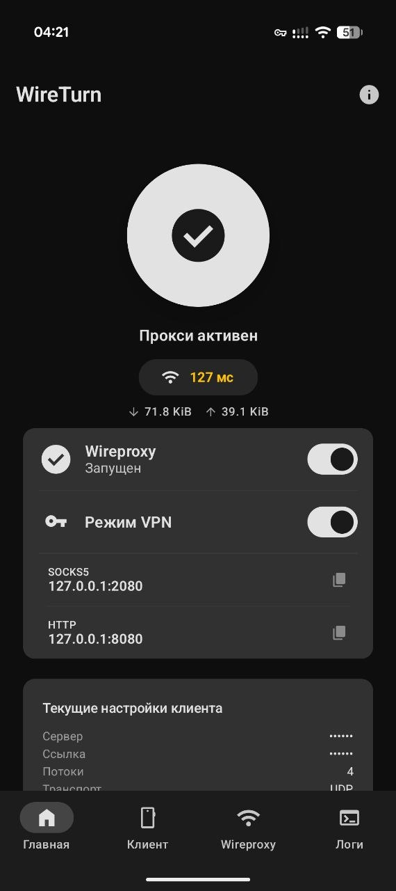
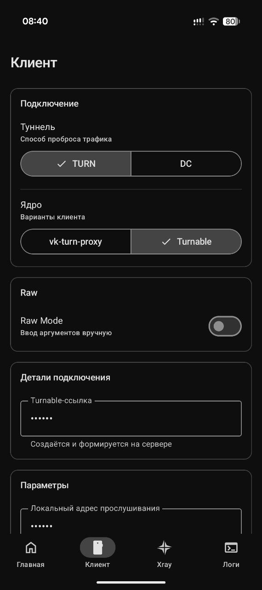
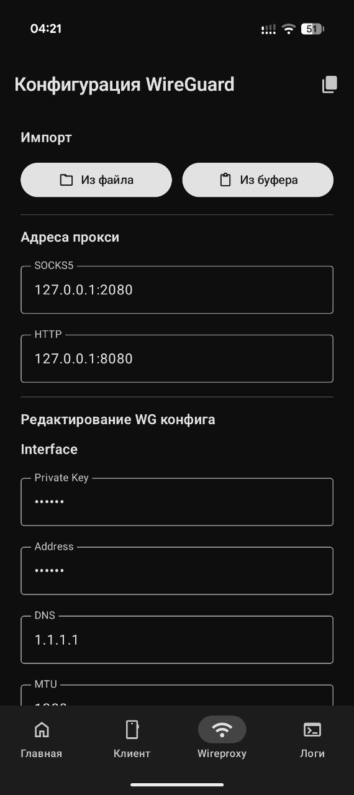
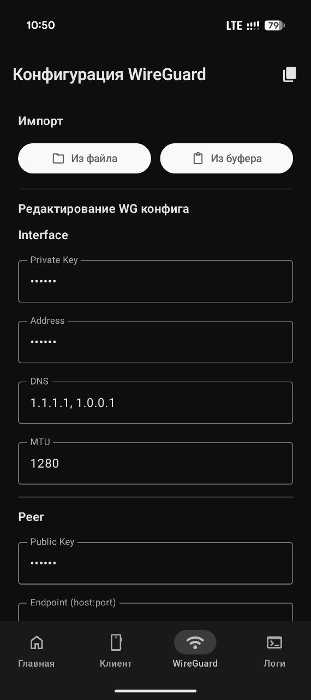

# WireTurn — Android TURN Proxy

Android-клиент для [vk-turn-proxy](https://github.com/spkprsnts/vk-turn-proxy/tree/dc) — проброс трафика через TURN-серверы. Поддерживает инкапсуляцию WireGuard и VLESS.

> **Disclaimer:** Проект предназначен исключительно для образовательных и исследовательских целей.

## Принцип работы

Пакеты инкапсулируются в DTLS 1.2 и передаются на TURN-сервер по протоколу STUN ChannelData (TCP или UDP). TURN-сервер пересылает трафик по UDP на ваш VPS, где он расшифровывается и передаётся в выбранный прокси-протокол (WireGuard или VLESS). Учётные данные для TURN генерируются автоматически из ссылки на звонок.

## Возможности

- **VPN Mode (Global)** — полноценный VPN-режим (TUN) для перенаправления трафика всего устройства через прокси (на базе `tun2socks`).
- **Xray Engine** — встроенный прокси-движок для работы в режиме локального SOCKS5/HTTP прокси.
- **Поддержка VLESS** — использование `vless://` ссылок для инкапсуляции трафика.
- **Поддержка WireGuard** — использование классических конфигураций WireGuard.
- **DataChannel (DC)** — работа через **Salute Jazz** и **WB Stream** для минимизации задержек и обхода блокировок.
- **Privacy Mode** — режим конфиденциальности, скрывающий чувствительные данные (ссылки, адреса, UUID) в интерфейсе.
- **Метрики в реальном времени** — отображение пинга до цели и скорости передачи данных (RX/TX) непосредственно на главном экране.
- **Умный Watchdog** — автоматическое переподключение при смене сети, потере пакетов или падении процесса ядра.
- **Автоматизация** — управление через Quick Settings Tile (плитка в шторке) или через Broadcast Intent API.
- **Кастомное ядро** — возможность загрузки собственного бинарника `libvkturn.so` (ELF) прямо из интерфейса.
- **Авто-обновление** — встроенная система проверки и установки обновлений приложения.
- **Material You** — современный интерфейс с поддержкой динамических цветов и тактильной отдачи (Haptic Feedback).

## Автоматизация (Intent API)

Управление прокси из сторонних приложений (например, Tasker):
- **Запуск:** `com.wireturn.app.START_PROXY`
- **Остановка:** `com.wireturn.app.STOP_PROXY`

## Скриншоты

<p float="left">
  
  
  
  
</p>

## Требования

- Android 8.0+ (API 26)
- Архитектуры: `arm64-v8a`, `armeabi-v7a`, `x86_64`
- VPS с установленным WireGuard или VLESS-сервером

## Быстрый старт

### 1. Серверная часть

**Обычный режим (через ссылку на звонок):**
```bash
# Скачать бинарник
wget https://github.com/cacggghp/vk-turn-proxy/releases/latest/download/server-linux-amd64
chmod +x server-linux-amd64

# Запустить для WireGuard
nohup ./server-linux-amd64 -listen 0.0.0.0:56000 -connect 127.0.0.1:<порт_wg> > server.log 2>&1 &

# Запустить для VLESS
nohup ./server-linux-amd64 -vless -listen 0.0.0.0:56000 -connect 127.0.0.1:<порт_vless> > server.log 2>&1 &
```

**Режим DataChannel (DC):**
Требуется сервер с поддержкой Jazz/WB Stream.
- **Репозиторий:** [spkprsnts/vk-turn-proxy (branch: dc)](https://github.com/spkprsnts/vk-turn-proxy/tree/dc)

### 2. Настройка клиента

1. Установите APK из [Releases](https://github.com/spkprsnts/WireTurn/releases/latest).
2. На вкладке **Клиент** укажите адрес сервера и ссылку на звонок (или данные DC).
3. Настройте протокол инкапсуляции:
    - **WireGuard**: настройте конфигурацию на вкладке **WireGuard**.
   - **VLESS**: включите **VLESS-режим** в настройках и вставьте вашу `vless://` ссылку.
4. На главном экране нажмите **большую кнопку запуска** для инициализации ядра `vk-turn-proxy`.
5. Для начала работы активируйте один из режимов:
   - **Включите Xray**: для работы через встроенный прокси (SOCKS5/HTTP).
   - **Включите Режим VPN**: для глобального проксирования трафика всего устройства.

## Стек технологий

- **Kotlin** + **Jetpack Compose** (Material 3)
- **Coroutines & StateFlow** — полностью реактивная логика.
- **DataStore (Preferences)** — современное хранение настроек.
- **Splash Screen API** — поддержка нативного сплэша Android 12+.
- **Native Go Kernels**:
    - `libvkturn.so` — ядро проброса TURN ([spkprsnts/vk-turn-proxy](https://github.com/spkprsnts/vk-turn-proxy/tree/dc)).
    - `libxray.so` — движок Xray (WireGuard/VLESS) ([spkprsnts/vless-client](https://github.com/spkprsnts/vless-client)).
    - `libtun2socks.so` — сетевой стек для VPN-режима.

## Упоминания

- [cacggghp/vk-turn-proxy](https://github.com/cacggghp/vk-turn-proxy) — автор оригинального ядра.
- [alxmcp/vk-turn-proxy](https://github.com/alxmcp/vk-turn-proxy) — оригинальная реализация DataChannel.
- [samosvalishe/turn-proxy-android](https://github.com/samosvalishe/turn-proxy-android) — база UI и логики.
- [XTLS/Xray-core](https://github.com/XTLS/Xray-core) — база для ядра Xray.
- [xjasonlyu/tun2socks](https://github.com/xjasonlyu/tun2socks) — реализация tun2socks.

## Лицензия

[GPL-3.0](LICENSE)
