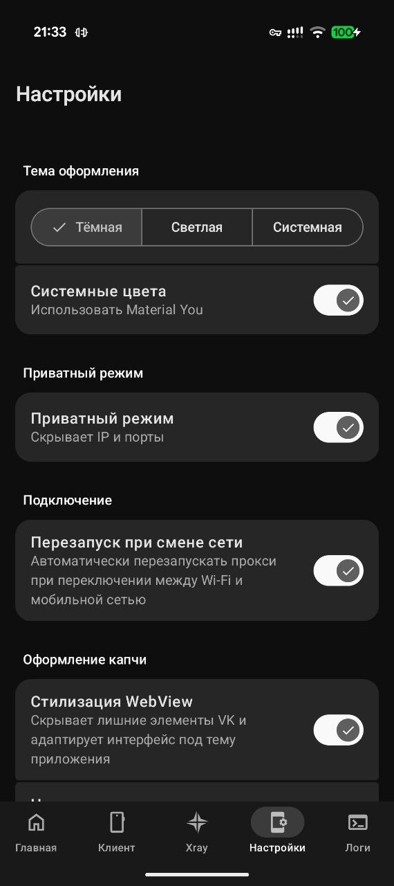

# WireTurn — Android TURN Proxy

Android-клиент для [vk-turn-proxy](https://github.com/spkprsnts/vk-turn-proxy/tree/dc) и [Turnable](https://github.com/TheAirBlow/Turnable) — проброс трафика через TURN-серверы. Поддерживает инкапсуляцию WireGuard и VLESS.

> **Disclaimer:** Проект предназначен исключительно для образовательных и исследовательских целей.

## Принцип работы

Пакеты инкапсулируются в DTLS 1.2 и передаются на TURN-сервер по протоколу STUN ChannelData (TCP или UDP). TURN-сервер пересылает трафик по UDP на ваш VPS, где он расшифровывается и передаётся в выбранный прокси-протокол (WireGuard или VLESS). Учётные данные для TURN генерируются автоматически из ссылки на звонок (для vk-turn-proxy), берутся из `turnable://` ссылки или из параметров DataChannel.

## Возможности

- **VPN Mode & Split Tunneling** — полноценный VPN-режим (TUN) с поддержкой режимов исключения (Bypass) и включения (Include) конкретных приложений. Реализована группировка приложений и быстрый поиск.
- **Система профилей** — создание независимых конфигураций, поддержка массового импорта/экспорта (JSON, ZIP) и удобное управление.
- **Xray Engine** — встроенный прокси-движок для работы с VLESS и WireGuard в режиме локального SOCKS5/HTTP прокси.
- **Два режима работы клиента**:
    - **TURN Mode** — классический проброс через TURN-серверы (выбор ядра: vk-turn-proxy или Turnable).
    - **DC Mode (DataChannel)** — работа через инфраструктуру **Salute Jazz** и **WB Stream** (форк-ядро vk-turn-proxy).
- **Быстрое управление** — смена профиля прямо из уведомления, управление через Quick Settings Tile или Broadcast Intent API.
- **Метрики в реальном времени** — интерактивное отображение пинга и актуальной скорости передачи данных (RX/TX) на главном экране.
- **Умный Watchdog** — автоматическое переподключение при смене сети (настраиваемо), потере пакетов или падении процесса ядра.
- **Privacy Mode** — режим конфиденциальности, скрывающий чувствительные данные (ссылки, адреса, UUID) в интерфейсе.
- **Кастомное ядро** — возможность загрузки собственного бинарника прокси-туннеля и гибкая настройка параметров запуска.
- **Авто-обновление** — встроенная система проверки обновлений с поддержкой **Beta (Unstable)** канала, просмотром ченджлога (Markdown) и обновлением по хэшу коммита.
- **Стилизация капчи** — глубокая кастомизация внешнего вида WebView-капчи (инъекция CSS/JS) с поддержкой акцентных цветов темы.
- **Material You** — современный интерфейс с поддержкой динамических цветов, expressive motion анимаций, кастомным Splash Screen и тактильной отдачей.

## Автоматизация (Intent API)

Управление прокси из сторонних приложений (например, Tasker):
- **Запуск:** `com.wireturn.app.START_PROXY`
- **Остановка:** `com.wireturn.app.STOP_PROXY`

## Скриншоты

<p>
  
  
  
  
  
</p>

## Требования

- Android 8.0+ (API 26)
- Архитектуры: `arm64-v8a`, `x86_64` (поддержка 32-битных систем прекращена)
- VPS с установленным WireGuard или VLESS-сервером

## Быстрый старт

### 1. Серверная часть

**vk-turn-proxy:**
```bash
# Скачать бинарник
wget https://github.com/cacggghp/vk-turn-proxy/releases/latest/download/server-linux-amd64
chmod +x server-linux-amd64

# Запустить для WireGuard
nohup ./server-linux-amd64 -listen 0.0.0.0:56000 -connect 127.0.0.1:<порт_wg> > server.log 2>&1 &

# Запустить для VLESS
nohup ./server-linux-amd64 -vless -listen 0.0.0.0:56000 -connect 127.0.0.1:<порт_vless> > server.log 2>&1 &
```

**Режим DataChannel (DC):**
Требуется сервер с поддержкой Jazz/WB Stream.
- **Репозиторий:** [spkprsnts/vk-turn-proxy (branch: dc)](https://github.com/spkprsnts/vk-turn-proxy/tree/dc)

**Turnable:**
Используйте сервер и инструкции из репозитория.
- **Репозиторий:** [TheAirBlow/Turnable](https://github.com/TheAirBlow/Turnable/blob/main/README_RU.md)

### 2. Настройка клиента

1. **Установка:**
   Скачайте и установите APK из раздела [Releases](https://github.com/spkprsnts/WireTurn/releases/latest). Для доступа к новейшим функциям включите «Бета-версии» в настройках.

2. **Работа с профилями:**
   Все настройки привязаны к профилям. Вы можете импортировать несколько JSON-файлов одновременно или восстановить всё из ZIP-архива.

3. **Конфигурация прокси-туннеля:**
   В настройках профиля перейдите в раздел **Клиент**:
   - **TURN**: адрес сервера и ссылка на звонок/сессию.
   - **DC**: выбор сервиса и ввод ID комнаты/кода.
   - **Локальный адрес**: порт, который будет слушать клиент (например, `127.0.0.1:9000`).

4. **Настройка Xray (для WireGuard/VLESS):**
   - Перейдите в раздел **Xray** и импортируйте конфиг.
   - При несовпадении `Endpoint` в Xray с локальным адресом клиента приложение предложит исправить это в один клик.

5. **Запуск и управление:**
   - На вкладке **Главная** нажмите центральную кнопку для запуска.
   - **VPN Mode**: системный VPN-режим. Работает **только при включенном Xray**, так как использует его как вышестоящий прокси.
   - **Split Tunneling**: в настройках можно выбрать приложения-исключения для VPN-режима.

> **Примечание:** Обратите внимание на соответствие протоколов. Если прокси-туннель настроен на работу с VLESS (флаг `-vless` на сервере), то и в Xray должен быть настроен протокол VLESS. Прямой совместимости между WireGuard и VLESS через один туннель нет.

## Стек технологий

- **Kotlin** + **Jetpack Compose** (Material 3)
- **Native Kernels (C/Go)** (автоматическая сборка из исходников через Git-субмодули):
    - `libvkturn.so` — ядро проброса TURN ([spkprsnts/vk-turn-proxy](https://github.com/spkprsnts/vk-turn-proxy/tree/dc)).
    - `libxray.so` — движок Xray (WireGuard/VLESS) ([spkprsnts/vless-client](https://github.com/spkprsnts/vless-client)).
    - `libturnable.so` — ядро Turnable ([TheAirBlow/Turnable](https://github.com/TheAirBlow/Turnable)).
    - `libhevsocks5.so` — сетевой стек для VPN-режима ([heiher/hev-socks5-tunnel](https://github.com/heiher/hev-socks5-tunnel)).

## Для разработчиков

Проект поддерживает автоматизированную сборку нативных компонентов.
```bash
git clone --recursive https://github.com/spkprsnts/WireTurn.git
./gradlew buildCBinaries buildGoBinaries # Сборка всех .so через Docker/WSL
./gradlew assembleDebug
```

## Упоминания

- [TheAirBlow/Turnable](https://github.com/TheAirBlow/Turnable) — ядро Turnable.
- [cacggghp/vk-turn-proxy](https://github.com/cacggghp/vk-turn-proxy) — автор оригинального ядра.
- [alxmcp/vk-turn-proxy](https://github.com/alxmcp/vk-turn-proxy) — оригинальная реализация DataChannel.
- [samosvalishe/turn-proxy-android](https://github.com/samosvalishe/turn-proxy-android) — база UI и логики.
- [XTLS/Xray-core](https://github.com/XTLS/Xray-core) — база для ядра Xray.
- [heiher/hev-socks5-tunnel](https://github.com/heiher/hev-socks5-tunnel) — реализация сетевого стека для VPN-режима.

## Лицензия

[GPL-3.0](LICENSE)
