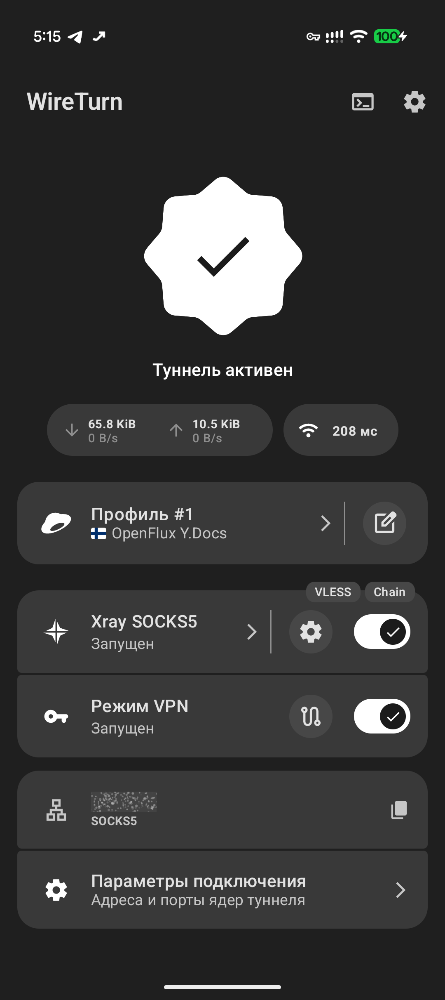
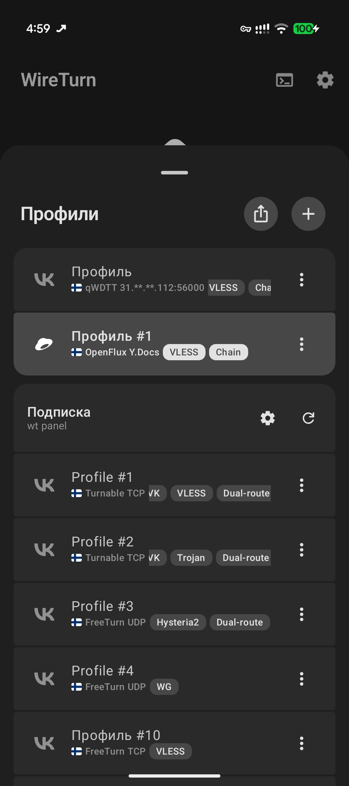
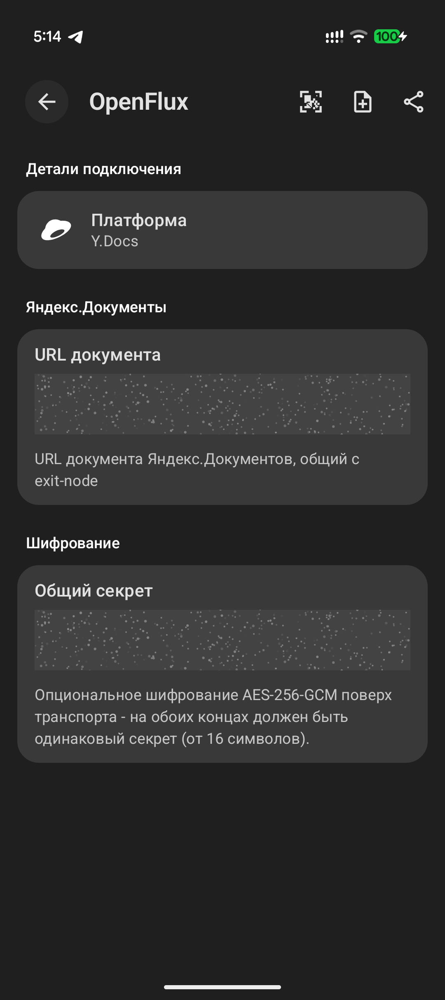
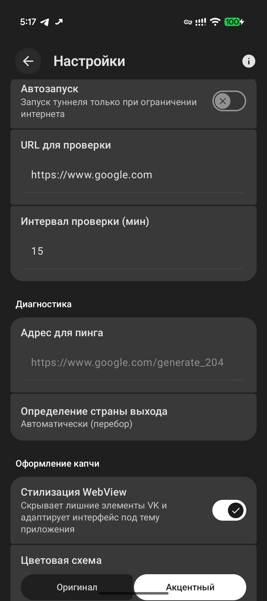
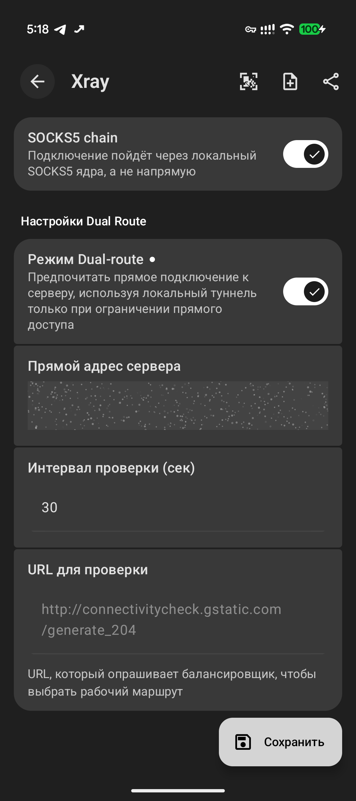
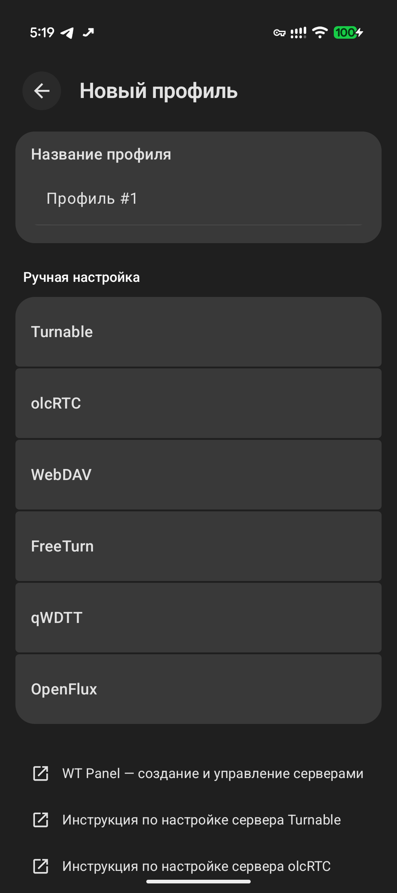
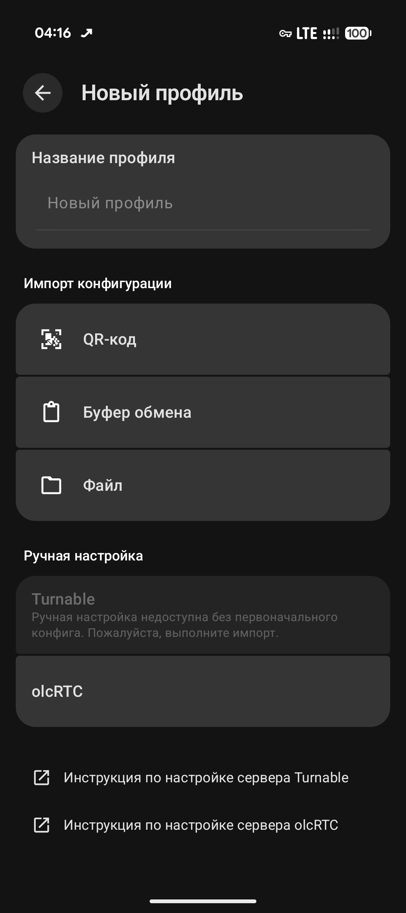

<p align="center">
  
</p>

# WireTurn — Android WebRTC & WebDAV Tunnel

Android-клиент для [Turnable](https://github.com/TheAirBlow/Turnable), [olcRTC](https://github.com/openlibrecommunity/olcrtc), [WebDAV](https://github.com/spkprsnts/webdav-tunnel) и [FreeTurn](https://github.com/samosvalishe/free-turn-proxy) — туннелирование трафика через WebRTC и WebDAV.

> **Disclaimer:** Проект предназначен исключительно для образовательных и исследовательских целей.

## Принцип работы

WireTurn упаковывает трафик в стандартные протоколы WebRTC (**DTLS**/**SRTP**) или передаёт его через облачные хранилища, в зависимости от выбранного ядра.

### Turnable
Туннелирование TCP/UDP через TURN-серверы или SFU-платформы: несколько параллельных пиров (Multi-Peer) для пропускной способности и стабильности, мультиплексирование потоков, опциональная имитация видеотрафика (SRTP/DTLS поверх VP8) для работы через SFU в режиме Relay, сквозное шифрование рукопожатия.

### olcRTC
Туннелирование через платформы видеоконференций с SOCKS5-прокси на клиенте. Транспорты: **DataChannel** (SCTP, низкая задержка), **VP8Channel** (стеганография в видеопотоке через KCP), **SEIChannel** (упаковка в SEI-метаданные H.264), **VideoChannel** (визуальная стеганография — QR-коды/графические тайлы).

### WebDAV
Туннелирование через любое WebDAV-совместимое облачное хранилище: передача данных поллингом, трафик неотличим от обычной работы с облачным диском по HTTPS.

### FreeTurn
Туннелирование через WebRTC поверх UDP с подпиской на список серверов (поддерживаются как обычные, так и Base64-закодированные подписки), гибкой настройкой обфускации/транспорта до TURN-relay и ручным решением капчи через встроенный браузер при необходимости.

## Возможности

- **Xray-core** — встроенный движок для VLESS/Trojan/Hysteria2 и WireGuard в режиме локального SOCKS5/HTTP-прокси.
- **Dual-route** — автоматическое переключение на прямой адрес сервера при его доступности, минуя WebRTC-туннель, для снижения задержек.
- **VPN-режим и Split Tunneling** — полноценный TUN-режим с исключением (Bypass) или включением (Include) конкретных приложений.
- **Профили и подписки** — независимые конфигурации, массовый импорт, автообновление по расписанию с учётом квоты трафика; импорт по диплинкам `wireturn://` и `wt://`. Подробности — в [спецификации подписок и профилей](docs/subscriptions.md).
- **Быстрое управление** — смена профиля из уведомления, Quick Settings Tile и Intent API.
- **Умное ожидание сети** — восстановление туннеля при появлении интернета без лишних уведомлений об ошибках.
- **Material 3 Expressive** — динамические цвета и expressive motion анимации.

## Автоматизация (Intent API)

Управление туннелем из сторонних приложений (например, Tasker):
- **Запуск:** `com.wireturn.app.START_CORE`
- **Остановка:** `com.wireturn.app.STOP_CORE`

## Скриншоты

<p>
  
  
  
  
  
  
  
</p>

## Быстрый старт

### Требования
- Android 8.0+ (API 26), архитектуры `arm64-v8a`/`x86_64`.
- VPS для серверной части (Turnable, olcRTC, FreeTurn или WebDAV) либо аккаунт в облаке с поддержкой WebDAV.

### Настройка
- **[WT Panel](https://github.com/spkprsnts/wt-panel)** — панель для создания и управления серверами
- **[Настройка сервера Turnable](docs/guides/turnable.md)**
- **[Настройка сервера olcRTC](docs/guides/olcrtc.md)**
- **[Спецификация подписок и профилей](docs/subscriptions.md)**

## Стек технологий

**Kotlin** + **Jetpack Compose** (Material 3 Expressive). Нативные компоненты (C/Go) собираются из исходников через Git-субмодули:

- `libturnable.so` — [TheAirBlow/Turnable](https://github.com/TheAirBlow/Turnable)
- `libolcrtc.so` — [openlibrecommunity/olcrtc](https://github.com/openlibrecommunity/olcrtc)
- `libwebdav.so` — [spkprsnts/webdav-tunnel](https://github.com/spkprsnts/webdav-tunnel)
- `libfreeturn.so` — [samosvalishe/free-turn-proxy](https://github.com/samosvalishe/free-turn-proxy)
- `libxray.so` — [spkprsnts/vless-client](https://github.com/spkprsnts/vless-client)
- `libhevsocks5.so` — сетевой стек VPN-режима, [heiher/hev-socks5-tunnel](https://github.com/heiher/hev-socks5-tunnel)

## Для разработчиков

Сборка нативных библиотек (`.so`) автоматизирована через Gradle-задачи; рекомендуется **Linux** (Ubuntu/Debian) или **Windows + WSL2**.

Зависимости: `build-essential`, `pkg-config`, `golang` (1.23+), `openjdk-21-jdk`, `python3`, `git`, `curl`.

```bash
sudo apt update && sudo apt install -y build-essential pkg-config git curl golang-go openjdk-21-jdk python3

git clone --recursive https://github.com/spkprsnts/WireTurn.git
./gradlew buildCBinaries buildGoBinaries   # нативные компоненты
./gradlew assembleDebug                    # APK
```

## Упоминания

- [TheAirBlow/Turnable](https://github.com/TheAirBlow/Turnable) — проект Turnable.
- [openlibrecommunity/olcrtc](https://github.com/openlibrecommunity/olcrtc) — проект olcRTC.
- [spkprsnts/webdav-tunnel](https://github.com/spkprsnts/webdav-tunnel) — проект WebDAV Tunnel.
- [samosvalishe/free-turn-proxy](https://github.com/samosvalishe/free-turn-proxy) — проект FreeTurn.
- [samosvalishe/turn-proxy-android](https://github.com/samosvalishe/turn-proxy-android) — база UI и логики.
- [XTLS/Xray-core](https://github.com/XTLS/Xray-core) — кодовая база Xray.
- [heiher/hev-socks5-tunnel](https://github.com/heiher/hev-socks5-tunnel) — реализация сетевого стека для VPN-режима.

## Лицензия

[GPL-3.0](LICENSE)
